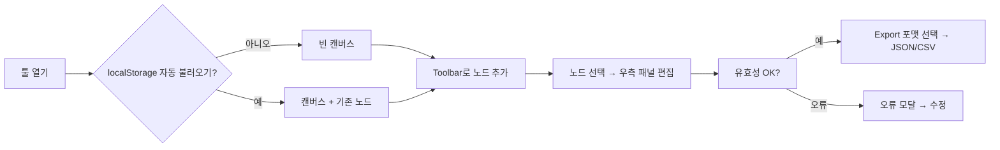

# PRD – **웹 기반 Dialogue Editor (프론트엔드-Only)**

> "Twine 느낌의 시각 편집 + 우측 폼 패널"—JSON/CSV Export 중심 MVP

---

## 1. 목표 및 배경

* **목적**: 개발 지식이 많지 않은 기획자가 대화 분기(텍스트 / 선택지 / 입력)를 시각적으로 작성하고, 검증된 JSON·CSV로 바로 내보내 개발 파이프라인에 투입할 수 있는 **브라우저 단독 툴**을 제공한다.
* **비전**:

  1. **MVP** — 서버·로그인 없이 배포 가능한 SPA, 노드 기반 에디팅, JSON/CSV 입·출력, 로컬 임시 저장.
  2. **1차 개선** — 대화 시뮬레이터, 콜백 키 관리 페이지, 확장 메타데이터.
  3. **장기** — 협업·버전 관리, 번역 워크플로 자동화, 커스텀 조건식/스크립트 지원.

---

## 2. 대상 사용자

| 유형          | 니즈                                          |
| ----------- | ------------------------------------------- |
| 기획자 (주 사용자) | 시나리오를 빠르게 시각화하고, 오류 없는 데이터 파일로 내보내기         |
| 개발자         | JSON 구조가 Typescript 타입과 1:1 대응, 수동 수정 필요 없음 |
| 번역·LQA      | CSV로 한글 원문과 key를 추출 → 외부 도구로 이어서 작업         |

---

## 3. 범위 정의

### 3.1 **MVP 기능 (필수)**

| #    | 기능                  | 상세                                                                                                           |
| ---- | ------------------- | ------------------------------------------------------------------------------------------------------------ |
| F-01 | **노드 캔버스**          | React Flow (or rete.js) 기반.<br>– drag-to-pan / scroll-to-zoom<br>– Toolbar: **"텍스트 / 선택지 노드 추가"** 버튼 (MVP는 2개 타입만)        |
| F-02 | **노드 생성 & 연결 UX**   | ① 빈 캔버스일 때 중앙 생성<br>② 이미 있으면 **가장 마지막에 생성한 노드의 아래쪽**에 gap(10px) 간격으로 배치<br>③ **선택지별 개별 연결**: Choice 노드에서 각 선택지 텍스트 오른쪽에 "+" 버튼 → 해당 선택지의 nextNodeKey로 새 노드 자동 생성·연결<br>**※ 노드 배치 규칙**: 마지막 생성 노드 기준 Y축 + 노드높이 + 10px 오프셋 (MVP 확정, 추후 변경 가능)                         |
| F-03 | **우측 속성 패널**        | 노드 클릭 시 열린다.<br>필드: `speaker`, `text`, 옵션 토글, speed, choices …<br>입력 즉시 캔버스 미리보기에 반영                         |
| F-04 | **로컬 임시 저장**        | 변경 시 localStorage `autoSave_v1` 키에 debounce(1 s) 저장                                                          |
| F-05 | **Import / Export** | **Export**: JSON (.json) 또는 CSV (.csv) 중 **사용자 선택**하여 단일 파일 다운로드<br>**Import**: JSON 또는 CSV 파일 업로드 지원 (각각 다른 파싱 로직)<br>– Export 전 실시간 검증; 실패 시 상세 오류 모달                            |
| F-06 | **자동 Key 추천**       | Export 시 `speakerKey`, `textKey`가 없으면 다음 형식으로 자동 추천:<br>• **speakerKey**: `npc_{id}` (고유 번호 기반)<br>• **textKey**: `{templateKey}_{sceneKey}_line_{id}` (일반 대화)<br>• **선택지 textKey**: `{templateKey}_{sceneKey}_choice_{id}` (선택지 전용)<br>패널에서 인라인 수정 가능 |
| F-07 | **유효성 검사**          | • dangling nextNodeKey (존재하지 않는 노드 참조), 누락 필드<br>• 중복 key 경고<br>**※ MVP에서는 순환 참조 허용** (루프 구조 지원)                                                          |
| F-08 | **레이아웃 저장**         | 노드 x-y 좌표를 JSON 에 포함해 재-로드 시 동일 레이아웃 복원                                                                      |

### 3.2 **비-MVP (추후 개선 기록)**

* G-01: 한글 원문·key 동시 입력/수정용 로컬라이징 전용 탭
* G-02: 플로우 시뮬레이터 (플레이 모드)
* G-03: 콜백 키 CRUD 페이지 + 검색
* G-04: 커스텀 메타데이터(감정, 카메라, SFX) 확장
* G-05: 버전 관리(Git)·다중 사용자 협업
* **G-06: InputDialogue 노드 생성 및 런타임 속성 지원**
  - 사용자 입력 노드 생성 기능 (정규식, placeholder, maxLength 등)
  - 입력 유효성 검사 및 에러 메시지 설정
  - 입력값 변수 저장 및 조건부 분기 연결
* **G-07: 순환 참조 감지 및 경고 시스템**
  - 노드 간 순환 참조 탐지 알고리즘
  - 루프 경로 시각화 및 경고 메시지
  - 의도적 루프 vs 실수 구분을 위한 사용자 선택 옵션

### 3.3 **Out of Scope (MVP)**

* 서버 API / DB
* 실시간 협업, 소켓通信
* 번역 파일 병합·포맷 변환(PO/XLIFF) 자동화
* **완전 오프라인 지원** (CDN 리소스, 웹폰트 등은 허용)

---

## 4. 데이터 모델 (MVP)

> **MVP JSON**은 사용자가 제시한 *Dialogue* 타입을 그대로 따르고, 추가로 레이아웃·메타 필드만 확장한다.

### 4.1 **데이터 계층 구조**

```
TemplateDialogues (템플릿 단위)
└── Scene (노드 묶음 - 하나의 대화 흐름)
    └── EditorNodeWrapper (개별 대화 노드)
        └── Dialogue (실제 대화 데이터)
```

* **Scene**: 하나의 연결된 대화 흐름을 나타내는 **노드들의 묶음**. 게임에서 "챕터"나 "에피소드" 단위로 생각할 수 있음.
* **TemplateDialogues**: 여러 Scene들을 포함하는 **템플릿 단위**. 예: "튜토리얼", "메인스토리_1장", "사이드퀘스트_A" 등
* **파일 저장 방식**: **템플릿 단위로 분리 저장**. 각 템플릿은 독립적인 JSON 파일로 관리됨.

### 4.2 **타입 정의**

```ts
interface EditorNodeWrapper {
  nodeKey: string;
  dialogue: Dialogue;     // ← document/data_scheme.md에 작성된 Discriminated Union 그대로
  position: { x: number; y: number }; // 캔버스 좌표
}

type Scene = Record<string, EditorNodeWrapper>;  // sceneKey → 노드들의 맵
type TemplateDialogues = Record<string, Scene>;  // templateKey → Scene들의 맵

// 에디터에서 현재 작업 중인 템플릿 데이터
interface EditorState {
  currentTemplate: string;  // 현재 편집 중인 템플릿 이름
  templateData: TemplateDialogues;  // 현재 템플릿의 모든 Scene
  currentScene: string;    // 현재 편집 중인 Scene
}

// MVP 제한사항:
// - 실제 노드 생성은 TextDialogue, ChoiceDialogue만 지원
// - InputDialogue는 타입 정의만 존재하며, 노드 생성 UI는 비활성화
// - 추후 G-06에서 InputDialogue 런타임 속성(정규식, placeholder 등) 확장 예정
```

### 4.3 **파일 구조 예시**

```
# 로컬 저장소 구조
localStorage:
  - template_tutorial.json        // 튜토리얼 템플릿
  - template_mainStory_ch1.json   // 메인스토리 1장 템플릿
  - template_sideQuest_A.json     // 사이드퀘스트 A 템플릿

# 각 템플릿 파일 내용 예시 (template_tutorial.json)
{
  "intro": {
    "node_001": {
      "nodeKey": "node_001",
      "dialogue": { ... },
      "position": { "x": 100, "y": 200 }
    },
    "node_002": { ... }
  },
  "battle-tutorial": {
    "node_003": { ... }
  }
}
```

* **CSV Export**:

  1. **dialogue.csv** – 대화 데이터 및 선택지 정보
     ```
     컬럼: templateKey,sceneKey,nodeKey,textKey,speakerKey,type,choices_textKeys,choices_nextKeys
     
     예시:
     tutorial,intro,node_001,tutorial_intro_line_1,npc_1,text,,
     tutorial,intro,node_002,tutorial_intro_line_2,npc_2,choice,"tutorial_intro_choice_1; tutorial_intro_choice_2","node_003; node_004"
     ```
     - **choices_textKeys**: 선택지들의 textKey를 `;` (세미콜론 + 공백)으로 구분한 문자열
     - **choices_nextKeys**: 각 선택지에 연결된 다음 노드의 nodeKey를 `;` (세미콜론 + 공백)으로 구분한 문자열
     - 텍스트/입력 노드는 choices 컬럼들이 빈 값

  2. **localization.csv** – 다국어 텍스트 데이터 (MVP는 한국어만)
     ```
     컬럼: key,ko
     
     예시:
     tutorial_intro_line_1,"안녕하세요. 튜토리얼을 시작합니다."
     tutorial_intro_line_2,"어떤 것을 선택하시겠습니까?"
     tutorial_intro_choice_1,"첫 번째 선택지"
     tutorial_intro_choice_2,"두 번째 선택지"
     npc_1,"내레이터"
     npc_2,"가이드"
     ```
     - **key**: textKey 또는 speakerKey
     - **ko**: 한국어 원문 텍스트
     - 추후 확장 시 `en`, `ja` 등의 컬럼 추가 예정

---

## 5. UX 흐름



---

## 6. 기술 스택

| 레이어    | 선택 이유                                       |
| ------ | ------------------------------------------- |
| **UI** | React + Vite + TypeScript                   |
| 시각 노드  | React Flow (MIT, 노드/에지 커스텀 쉬움)              |
| 상태     | Zustand (로컬 상태 단순)                          |
| 스타일    | Tailwind CSS (CDN 또는 번들, 빠른 프로토)                       |
| 검증     | zod Schema → Re-usable validator            |
| 번들     | 단일 `index.html` + `dist` (GitHub Pages 배포, CDN 리소스 허용) |

---

## 7. 비기능 요건

| 항목      | 목표                                      |
| ------- | --------------------------------------- |
| 성능      | **한 템플릿당 100개 노드 제한** (MVP 고정, 추후 수정 가능)              |
| 브라우저 호환 | Chromium 105+, Firefox 100+, Safari 15+ |
| 보안      | 서버 없는 SPA, 외부 API 요청 없음 (CDN 리소스 허용)                 |
| 접근성     | 기본 키보드 탐색, 폼 ARIA 라벨                    |

---

## 8. Acceptance Criteria (MVP)

| ID    | 시나리오                                             | 기준                          |
| ----- | ------------------------------------------------ | --------------------------- |
| AC-01 | 새 텍스트 노드를 추가해 speaker · text 입력 → JSON 저장        | JSON 내 동일 내용 존재             |
| AC-02 | ChoiceDialogue에서 **특정 선택지의 "+" 버튼** 클릭 → 해당 선택지의 nextNodeKey로 새 노드 자동 연결 | 에지가 클릭한 선택지 → 새 node로 정확히 생성 |
| AC-03 | `nextNodeKey`가 비어있는 노드가 있으면 **Export 버튼 비활성화**   | 버튼 disabled & 설명 툴팁         |
| AC-04 | 브라우저 새로고침 후에도 Canvas 레이아웃 복원                     | 노드 좌표 재현                    |
| AC-05 | **JSON Export → JSON Import** 또는 **CSV Export → CSV Import** 직후 데이터 무손실                       | deepEqual (true)            |

---

## 9. 일정·마일스톤 (제안)

| 주차 | 목표                                           |
| -- | -------------------------------------------- |
| 1  | 기본 프로젝트 셋업, Dialogue 타입 정의, React Flow POC   |
| 2  | 노드 추가/편집·우측 패널 라이브 업데이트                      |
| 3  | Import/Export, zod 검증, localStorage autosave |
| 4  | 유효성 UI, 자동 key 추천, CSV 파이프라인                 |
| 5  | 폴리싱 & QA → GitHub Pages 배포 **(MVP 완료)**      |
| 6+ | 시뮬레이터·콜백 관리 등 G-01 \~ G-03 착수                |

---

## 10. 리스크 & 대응

| 리스크                | 완화 전략                                                 |
| ------------------ | ----------------------------------------------------- |
| React Flow 러닝커브    | 공식 예제 수정 → 커스텀 노드·에지 단계적 적용                           |
| 대용량 캔버스 성능         | 노드 virtualisation 옵션 · debounced 프리뷰                  |
| CSV ↔ JSON 스키마 불일치 | 단일 Source of Truth → zod Schema 변환기만 두고 UI·I/O는 공통 사용 |

---

## 11. 향후 확장 체크리스트 (요약)

1. **In-browser 시뮬레이터** – flags 스탭 포함
2. **콜백 라이브러리 관리** – "callback.json" CRUD
3. **멀티-언어 열 추가 & PO/XLIFF 내보내기**
4. **GitHub Gist/Repo 저장 API** (버전 관리)
5. **다중 사용자 실시간 협업** (WebRTC / CRDT)

---