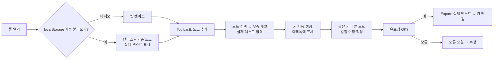

# PRD – **웹 기반 Dialogue Editor (프론트엔드-Only)**

> "Twine 느낌의 시각 편집 + 우측 폼 패널"—JSON/CSV Export 중심 MVP

---

## 1. 목표 및 배경

* **목적**: 개발 지식이 많지 않은 기획자가 대화 분기(텍스트 / 선택지 / 입력)를 시각적으로 작성하고, 검증된 JSON·CSV로 바로 내보내 개발 파이프라인에 투입할 수 있는 **브라우저 단독 툴**을 제공한다.
* **핵심 철학**: **컨텐츠 작성과 키 관리의 완전 분리** - 기획자는 실제 텍스트에만 집중하고, 로컬라이징 키는 백그라운드에서 자동 관리
* **비전**:

  1. **MVP** — 서버·로그인 없이 배포 가능한 SPA, 노드 기반 에디팅, JSON/CSV 입·출력, 로컬 임시 저장.
  2. **1차 개선** — 대화 시뮬레이터, 콜백 키 관리 페이지, 로컬라이징 전용 탭, 확장 메타데이터.
  3. **장기** — 협업·버전 관리, 번역 워크플로 자동화, 커스텀 조건식/스크립트 지원.

---

## 2. 대상 사용자

| 유형          | 니즈                                          |
| ----------- | ------------------------------------------- |
| 기획자 (주 사용자) | **실제 대화 내용만 작성**, 키 관리는 신경쓰지 않고 시나리오에 집중         |
| 개발자         | JSON 구조가 Typescript 타입과 1:1 대응, 수동 수정 필요 없음 |
| 번역·LQA      | CSV로 한글 원문과 key를 추출 → 외부 도구로 이어서 작업         |

---

## 3. 범위 정의

### 3.1 **MVP 기능 (필수)**

| #    | 기능                  | 상세                                                                                                           |
| ---- | ------------------- | ------------------------------------------------------------------------------------------------------------ |
| F-01 | **노드 캔버스**          | React Flow (or rete.js) 기반.<br>– drag-to-pan / scroll-to-zoom<br>– Toolbar: **"텍스트 / 선택지 노드 추가"** 버튼 (MVP는 2개 타입만)        |
| F-02 | **노드 생성 & 연결 UX**   | ① 빈 캔버스일 때 중앙 생성<br>② 이미 있으면 **가장 마지막에 생성한 노드의 아래쪽**에 gap(10px) 간격으로 배치<br>③ **선택지별 개별 연결**: Choice 노드에서 각 선택지 텍스트 오른쪽에 "+" 버튼 → 해당 선택지의 nextNodeKey로 새 노드 자동 생성·연결<br>**※ 노드 배치 규칙**: 마지막 생성 노드 기준 Y축 + 노드높이 + 10px 오프셋 (MVP 확정, 추후 변경 가능)                         |
| F-03 | **우측 속성 패널**        | 노드 클릭 시 열린다.<br>**실제 텍스트 입력**: `speakerText`, `contentText` (기획자가 보는 실제 내용)<br>**키 표시**: 입력 필드 아래 자동 생성된 키 표시<br>입력 즉시 캔버스 미리보기에 **실제 텍스트**로 반영                         |
| F-04 | **로컬 임시 저장**        | 변경 시 localStorage `autoSave_v1` 키에 debounce(1 s) 저장                                                          |
| F-05 | **Import / Export** | **Export**: JSON (.json) 또는 CSV (.csv) 중 **사용자 선택**하여 단일 파일 다운로드<br>**Import**: JSON 또는 CSV 파일 업로드 지원 (각각 다른 파싱 로직)<br>– Export 전 실시간 검증; 실패 시 상세 오류 모달                            |
| F-06 | **컨텐츠-키 분리 관리**       | **기획자 인터페이스**: 실제 텍스트만 입력/편집<br>**백그라운드 키 관리**: 자동 생성된 key-value 매핑 저장소<br>**키 표시**: 입력 필드 하단에 연결된 키 표시<br>**키 수정**: 두 단계 편집 (전체 수정 vs 새 키 분리)<br>**일괄 수정**: 같은 키를 사용하는 모든 텍스트 동시 수정 |
| F-07 | **유효성 검사**          | • dangling nextNodeKey (존재하지 않는 노드 참조), 누락 필드<br>• 중복 key 경고<br>**※ MVP에서는 순환 참조 허용** (루프 구조 지원)                                                          |
| F-08 | **레이아웃 저장**         | 노드 x-y 좌표를 JSON 에 포함해 재-로드 시 동일 레이아웃 복원                                                                      |

### 3.2 **비-MVP (추후 개선 기록)**

* **G-01: 한글 원문·key 동시 입력/수정용 로컬라이징 전용 탭** ← **우선순위 상승**
* G-02: 플로우 시뮬레이터 (플레이 모드)
* G-03: 콜백 키 CRUD 페이지 + 검색
* G-04: 커스텀 메타데이터(감정, 카메라, SFX) 확장
* G-05: 버전 관리(Git)·다중 사용자 협업
* **G-06: InputDialogue 노드 생성 및 런타임 속성 지원**
  - 사용자 입력 노드 생성 기능 (정규식, placeholder, maxLength 등)
  - 입력 유효성 검사 및 에러 메시지 설정
  - 입력값 변수 저장 및 조건부 분기 연결
* **G-07: 순환 참조 감지 및 경고 시스템**
  - 노드 간 순환 참조 탐지 알고리즘
  - 루프 경로 시각화 및 경고 메시지
  - 의도적 루프 vs 실수 구분을 위한 사용자 선택 옵션

### 3.3 **Out of Scope (MVP)**

* 서버 API / DB
* 실시간 협업, 소켓通信
* 번역 파일 병합·포맷 변환(PO/XLIFF) 자동화
* **완전 오프라인 지원** (CDN 리소스, 웹폰트 등은 허용)

---

## 4. 데이터 모델 (MVP)

> **핵심 설계**: 컨텐츠(실제 텍스트)와 키(로컬라이징)의 완전 분리

### 4.1 **데이터 계층 구조**

```
TemplateDialogues (템플릿 단위)
├── Scene (노드 묶음 - 하나의 대화 흐름)
│   └── EditorNodeWrapper (개별 대화 노드)
│       └── Dialogue (실제 대화 데이터 - 키 참조만)
└── LocalizationStore (key-value 매핑 저장소)
    └── LocalizationEntry (키별 텍스트 데이터)
```

### 4.2 **타입 정의**

```ts
// 백그라운드 key-value 저장소
interface LocalizationEntry {
  ko: string;           // 한국어 원문 (기획자가 입력한 실제 텍스트)
  usedBy: string[];     // 이 키를 사용하는 nodeKey들
  createdAt: number;    // 생성 시점
  autoGenerated: boolean; // 자동 생성 여부
}

interface LocalizationStore {
  [key: string]: LocalizationEntry;
}

// 노드 데이터 - 키 참조만 저장
interface BaseDialogue {
  type: "text" | "choice" | "input";
  speakerKeyRef?: string;  // LocalizationStore의 키 참조
  textKeyRef?: string;     // LocalizationStore의 키 참조
  onEnterCallbackKey?: string;
  onExitCallbackKey?: string;
  isSkippable?: boolean;
}

interface EditorNodeWrapper {
  nodeKey: string;
  dialogue: Dialogue;     // 키 참조만 포함
  position: { x: number; y: number }; // 캔버스 좌표
}

type Scene = Record<string, EditorNodeWrapper>;
type TemplateDialogues = Record<string, Scene>;

// 전체 에디터 상태
interface EditorState {
  currentTemplate: string;
  templateData: TemplateDialogues;
  localizationStore: LocalizationStore;  // ← 새로 추가
  currentScene: string;
  selectedNodeKey?: string;
  lastNodePosition: { x: number; y: number };
}

// MVP 제한사항:
// - 실제 노드 생성은 TextDialogue, ChoiceDialogue만 지원
// - InputDialogue는 타입 정의만 존재하며, 노드 생성 UI는 비활성화
// - 추후 G-06에서 InputDialogue 런타임 속성(정규식, placeholder 등) 확장 예정
```

### 4.3 **키 자동 생성 패턴**

```ts
// 개선된 키 생성 패턴 (숫자 ID 기반)
interface KeyGenerationRules {
  speakerKey: "npc_{id}";           // "NPC 상인" → "npc_1", "npc_2" 순차 할당
  textKey: "line_{id}";             // 대화 텍스트 → "line_1", "line_2" 순차 할당  
  choiceKey: "choice_{id}";         // 선택지 텍스트 → "choice_1", "choice_2" 순차 할당
}

// 키 할당 로직
interface KeyAllocationStrategy {
  duplicateText: "REUSE_EXISTING_KEY";  // 동일 텍스트 → 기존 키 재사용
  newText: "ASSIGN_NEXT_ID";            // 새 텍스트 → 해당 타입의 다음 순번 ID 할당
  idTracking: "MAX_ID_PLUS_ONE";        // 각 타입별 마지막 ID 추적하여 자동 증가
}

// 키 수정 시 두 단계 편집
interface KeyEditAction {
  type: "UPDATE_ALL" | "CREATE_NEW";
  originalKey: string;
  newKey?: string;
  affectedNodes: string[];
}
```

### 4.4 **파일 구조 예시**

* **JSON Export**:
```json
{
  "dialogue": {
    "intro": {
      "node_001": {
        "nodeKey": "node_001",
        "dialogue": {
          "type": "text",
          "speakerKeyRef": "npc_1",
          "textKeyRef": "line_1"
        },
        "position": { "x": 100, "y": 200 }
      }
    }
  },
  "localization": {
    "npc_1": {
      "ko": "NPC 상인",
      "usedBy": ["node_001", "node_003"],
      "createdAt": 1703123456789,
      "autoGenerated": true
    },
    "line_1": {
      "ko": "어서오세요! 뭘 찾으시나요?",
      "usedBy": ["node_001"],
      "createdAt": 1703123456789,
      "autoGenerated": true
    }
  }
}
```

* **CSV Export** (기존과 동일):
  1. **dialogue.csv** – 대화 데이터 및 선택지 정보
  2. **localization.csv** – 다국어 텍스트 데이터

---

## 5. UX 흐름



### **기획자 워크플로 시나리오**

1. **컨텐츠 작성**: "NPC 상인", "어서오세요! 뭘 찾으시나요?" 입력
2. **자동 키 생성**: 백그라운드에서 `npc_npc_상인`, `tutorial_intro_line_001` 생성
3. **키 표시**: 입력 필드 아래 작게 표시
4. **반복 텍스트**: "네"라고 입력하면 기존 "네" 키 재사용 여부 묻기
5. **키 수정**: 키 클릭 → 편집 UI → 전체 수정 vs 새 키 분리 선택
6. **Export**: 실제 텍스트가 키로 매핑되어 개발용 데이터 생성

---

## 6. 기술 스택

| 레이어    | 선택 이유                                       |
| ------ | ------------------------------------------- |
| **UI** | React + Vite + TypeScript                   |
| 시각 노드  | React Flow (MIT, 노드/에지 커스텀 쉬움)              |
| 상태     | Zustand (로컬 상태 단순, LocalizationStore 관리)                          |
| 스타일    | Tailwind CSS (CDN 또는 번들, 빠른 프로토)                       |
| 검증     | zod Schema → Re-usable validator            |
| 번들     | 단일 `index.html` + `dist` (GitHub Pages 배포, CDN 리소스 허용) |

---

## 7. 비기능 요건

| 항목      | 목표                                      |
| ------- | --------------------------------------- |
| 성능      | **한 템플릿당 100개 노드 제한** (MVP 고정, 추후 수정 가능)<br/>**텍스트 입력 최적화**: debounce 적용으로 실시간 키 처리 성능 향상              |
| 브라우저 호환 | Chromium 105+, Firefox 100+, Safari 15+ |
| 보안      | 서버 없는 SPA, 외부 API 요청 없음 (CDN 리소스 허용)                 |
| 접근성     | 기본 키보드 탐색, 폼 ARIA 라벨                    |

---

## 8. Acceptance Criteria (MVP)

| ID    | 시나리오                                             | 기준                          |
| ----- | ------------------------------------------------ | --------------------------- |
| AC-01 | 새 텍스트 노드를 추가해 실제 텍스트 입력 → 노드에 텍스트 표시, Export시 키 매핑        | 노드 표시는 실제 텍스트, JSON은 키 참조             |
| AC-02 | ChoiceDialogue에서 **특정 선택지의 "+" 버튼** 클릭 → 해당 선택지의 nextNodeKey로 새 노드 자동 연결 | 에지가 클릭한 선택지 → 새 node로 정확히 생성 |
| AC-03 | `nextNodeKey`가 비어있는 노드가 있으면 **Export 버튼 비활성화**   | 버튼 disabled & 설명 툴팁         |
| AC-04 | 브라우저 새로고침 후에도 Canvas 레이아웃 복원                     | 노드 좌표 재현, 실제 텍스트 표시                    |
| AC-05 | **JSON Export → JSON Import** 또는 **CSV Export → CSV Import** 직후 데이터 무손실                       | 텍스트-키 매핑 정확히 복원            |
| AC-06 | **같은 텍스트 입력 → 키 재사용 제안**, **키 수정 → 전체/분리 선택**                       | 중복 방지, 의도 명확히 구분            |

---

## 9. 일정·마일스톤 (업데이트)

### **완료된 단계 ✅**
| 주차 | 목표 | 상태 |
| -- | -------------------------------------------- | ---- |
| 1-3  | 기본 시스템, Import/Export | ✅ **완료** |
| 4  | 컨텐츠-키 분리 아키텍처 → LocalizationStore, 실제 텍스트 기반 UI | ✅ **완료** |
| 4.5  | QA 및 버그 수정 (9개 주요 버그 해결) | ✅ **완료** |

### **진행 계획 📅**

#### **Phase 1: MVP 완성** 🔥 **(최우선 - 1-2주)**
- **AC-02 구현**: 선택지별 "+" 버튼 자동 연결 기능
- **최종 QA**: 전체 AC 항목 재검증 및 회귀 버그 체크  
- **MVP 배포**: GitHub Pages 설정 및 첫 배포 **(MVP 완료 마일스톤)**

#### **Phase 2: 사용성 개선** 🟡 **(중요 - 2-3주)**
- **성능 최적화**: 100개 노드 제한 구현
- **기본 접근성**: 키보드 탐색, 반응형 디자인
- **UX 개선**: 중복 텍스트 모달 처리 방식 최종 결정

#### **Phase 3: 폴리싱** 🟢 **(선택적 - 1-2주)**
- **시각적 개선**: 애니메이션 및 트랜지션 추가
- **성능 튜닝**: 빌드 최적화 및 번들 크기 최적화

#### **Post-MVP: 확장 기능** 🔮 **(장기 계획)**
1. **G-01: 로컬라이징 전용 탭** (사용자 요청 높음)
2. **G-02: 플로우 시뮬레이터** (기획자 검증 도구)  
3. **G-06: InputDialogue 노드** (기능 완성도)
4. **G-03: 콜백 키 CRUD** (개발자 도구)
5. **G-07: 순환 참조 감지** (안정성)
6. **G-04: 커스텀 메타데이터** (확장성)
7. **G-05: 버전 관리** (협업 도구)

---